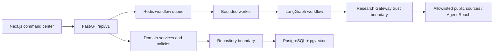

# GoPilot — GTM OS

GoPilot is an evidence-backed GTM research and account-intelligence copilot for
founder-led B2B teams. It turns a confirmed product profile into ranked account
opportunities, explains why each account fits and why the timing may matter, and
keeps every campaign draft behind human review.

The implemented MVP is a working deterministic vertical slice. Live research,
production authentication, and durable production persistence are explicitly
separated from the demo path and are not represented as complete.

## Overview

The primary unit of value is an `AccountOpportunityBrief`, not a scraped lead. Each
brief combines:

- separate Fit, Intent, Confidence, and Priority scores;
- deterministic score components and weights;
- evidence-linked “Why it fits” and “Why now” claims;
- time-sensitive business signals;
- an inspectable source passage and original URL;
- a recommended action and editable campaign draft;
- approve/reject controls and formula-safe CSV export.

## Problem

Small GTM teams often collect company research in several tools, mix facts with
assumptions, and rank accounts using opaque intuition. That makes it difficult to
answer the questions that matter: why this account, why now, how reliable is the
evidence, and what should a human do next?

## Product concept

```text
Understand the product
        ↓
Research the market
        ↓
Compare three ICP candidates
        ↓
Discover and research accounts
        ↓
Detect current intent signals
        ↓
Calculate deterministic scores
        ↓
Explain every material claim
        ↓
Recommend a human-reviewed action
```

GoPilot is not an autonomous SDR, mass-email tool, unrestricted scraper, or social
cookie automation system.

## Core workflow

The fixture-mode acceptance path creates a workspace and product profile, starts a
bounded research run, produces market findings and exactly three candidate ICPs,
pauses for ICP selection, ranks fixture accounts, opens an evidence-backed
opportunity brief, edits and approves a draft, exports approved accounts, and records
the major events in the audit log.

The browser demo begins with a pre-seeded Kubu Works workspace so the full result can
be inspected without paid APIs. The ICP selector, evidence drawer, score breakdowns,
campaign controls, and export are connected to the FastAPI API.

## Architecture



The fixture repository is an explicit development adapter. Production-shaped
SQLAlchemy models, Alembic migrations, Redis worker entrypoint, provider protocols,
and gateway boundaries are present, but the current executable demo does not pretend
those incomplete adapters are live.

See [ARCHITECTURE.md](ARCHITECTURE.md) and
[docs/architecture/SYSTEM_DESIGN.md](docs/architecture/SYSTEM_DESIGN.md).

## Agent architecture

The bounded LangGraph workflow contains nine deterministic stages:

1. product analysis
2. research planning
3. market intelligence
4. ICP generation
5. account discovery
6. account research
7. deterministic scoring
8. opportunity brief generation
9. campaign drafting

Agent/provider outputs cross typed Pydantic contracts before entering domain state.
External text is treated as untrusted data, agents do not receive unrestricted shell
access, and LLMs never emit final numeric scores. Prompt templates are versioned in
one module.

## Agent Reach integration

Agent Reach is isolated behind the Research Gateway. The reviewed reference is
version `1.4.2`, commit `97e9e63`; it is not installed by an application request.
The gateway implements a bounded `agent-reach doctor --json` capability check with
an executable allowlist, no shell, a timeout, output limits, JSON validation, and a
cache TTL.

Public web, RSS, public GitHub, and public YouTube are the intended low-risk channels.
Live adapters are currently **planned/configuration work**, not claimed as
implemented research.

## Technology stack

- Next.js 16, React 19, strict TypeScript, accessible native controls
- FastAPI, Pydantic 2, typed Python, SQLAlchemy async, Alembic
- PostgreSQL with pgvector-compatible migration setup
- Redis worker boundary
- LangGraph bounded workflow
- Pytest, Ruff, Mypy, ESLint, TypeScript, Node test runner

## Repository structure

```text
apps/web/                    Next.js command center
apps/api/                    FastAPI API, domain, migrations, tests
services/research_gateway/   URL policy, untrusted-content checks, adapters
services/worker/             Redis workflow consumer boundary
docs/                        Product, architecture, security, execution plans
infra/                       Infrastructure extension point
packages/shared-contracts/   Shared-contract extension point
```

## Local setup

Prerequisites: Node.js 22+, Python 3.11+, and npm.

```powershell
python -m venv .venv
.\.venv\Scripts\Activate.ps1
python -m pip install -r apps/api/requirements-dev.txt
npm.cmd install
npm.cmd run dev
```

Open [http://localhost:3000](http://localhost:3000). The API listens on
[http://127.0.0.1:8000](http://127.0.0.1:8000), with OpenAPI at `/docs`.

Run services separately when preferred:

```powershell
python -m uvicorn apps.api.app.main:app --reload --port 8000
npm.cmd --workspace apps/web run dev
```

## Environment variables

Copy `.env.example` to `.env` and keep `.env` uncommitted.

| Variable | Purpose |
|---|---|
| `APP_ENV` | `development`, `test`, or `production` |
| `DATABASE_URL` | Async PostgreSQL connection string |
| `REDIS_URL` | Redis queue/cache connection |
| `NEXT_PUBLIC_API_BASE_URL` | Browser-visible `/api/v1` base |
| `RESEARCH_MODE` | `fixture` or `live` |
| `DEMO_AUTH_ENABLED` | Enables clearly marked local demo principal |
| `SUPABASE_*` | Production authentication configuration |
| `OPENAI_API_KEY`, `OPENAI_MODEL` | Future live structured LLM provider |
| `AGENT_REACH_*` | Gateway capability configuration |
| `CORS_ALLOWED_ORIGINS` | Explicit browser origins |

Production startup rejects fixture research and demo authentication.

## Database setup

Start the local dependencies:

```powershell
docker compose up -d postgres redis
python -m alembic -c apps/api/alembic.ini upgrade head
```

Generate migration SQL without connecting:

```powershell
python -m alembic -c apps/api/alembic.ini upgrade head --sql
```

The initial migration creates tenant-scoped product, research, source, evidence, ICP,
account, signal, score, campaign, and audit tables with foreign keys and intentional
indexes. The production repository binding remains deferred.

## Demo mode

`RESEARCH_MODE=fixture` uses deterministic, source-shaped data and local demo auth.
Every fixture source has `demo_data=true`, and the UI displays `DEMO DATA`
prominently. The fixture provider never runs in production.

## Live research mode

`RESEARCH_MODE=live` is capability-gated and never falls back to fixtures. The
gateway and provider interfaces fail explicitly when an adapter is unavailable.
Completing live mode requires production auth, durable repository/worker wiring,
reviewed public-source adapters, credentials where legitimate, and deployment
configuration.

## Testing

```powershell
npm.cmd run test
npm.cmd run lint
npm.cmd run typecheck
npm.cmd run build
python -m alembic -c apps/api/alembic.ini upgrade head --sql
```

Coverage includes the end-to-end API journey, tenant isolation, evidence integrity,
score determinism, signal decay, production demo rejection, campaign approval, CSV
formula injection, bounded LangGraph stages, SSRF/DNS policy, exact-domain checks,
and prompt-injection classification.

## Security model

- authenticated workspace membership is resolved server-side;
- cross-workspace records return no data;
- production rejects demo auth and fixture research;
- significant claims require evidence IDs or `hypothesis` status;
- URL policy blocks localhost, private/link-local IPs, credentials, unsafe schemes,
  DNS rebinding, and lookalike platform domains;
- retrieved content cannot grant tool authority or change scores;
- Agent Reach stays behind an isolated allowlisted gateway;
- no cookie-backed social scraping, CAPTCHA/paywall bypass, or private-personal-data
  collection;
- no autonomous outreach; campaign drafts require human action;
- CSV values with spreadsheet formula prefixes are neutralized;
- secrets, cookies, tokens, and authorization headers are not logged or committed.

See [docs/security/THREAT_MODEL.md](docs/security/THREAT_MODEL.md) and
[docs/security/SOURCE_POLICY.md](docs/security/SOURCE_POLICY.md).

## Current MVP scope

| Capability | Status |
|---|---|
| Fixture onboarding-to-export API flow | Implemented |
| Responsive GTM command center | Implemented |
| Three-ICP comparison and selection | Implemented |
| Account opportunity brief and evidence drawer | Implemented |
| Deterministic scoring and signal decay | Implemented |
| Campaign edit/approve/reject and CSV export | Implemented |
| Tenant/security regression tests | Implemented |
| SQLAlchemy schema and Alembic migration | Implemented boundary |
| LangGraph execution graph | Experimental |
| Redis worker process | Experimental boundary |
| Agent Reach health/capability wrapper | Experimental |
| Supabase JWT verification | Planned |
| Live public-source research adapters | Planned |
| OpenAI structured provider | Planned |
| Durable PostgreSQL workflow repository | Planned |

## Future roadmap

- production Supabase JWT and role/permission enforcement;
- async PostgreSQL repositories and durable workflow checkpoints;
- reviewed web, RSS, GitHub, and YouTube adapters;
- structured OpenAI and embedding providers;
- scheduled account monitoring and richer feedback/outcome analytics;
- human-approved CRM, email-draft, and calendar adapters;
- custom scoring policies and vertical signal libraries.

## Known limitations

- The default running path is in-memory and resets on API restart.
- The demo has three defensible fixture accounts rather than manufacturing the
  20-account discovery target.
- Research findings are fixture-backed; live web retrieval is not enabled.
- The worker validates queue payload shape but production orchestration binding is
  not complete.
- Supabase auth, live LLM calls, embeddings, object storage, and production
  deployment are not claimed as complete.

## License and third-party notices

No open-source license has been granted for this repository unless the repository
owner adds one. See [THIRD_PARTY_NOTICES.md](THIRD_PARTY_NOTICES.md) for dependency
and Agent Reach review information.
